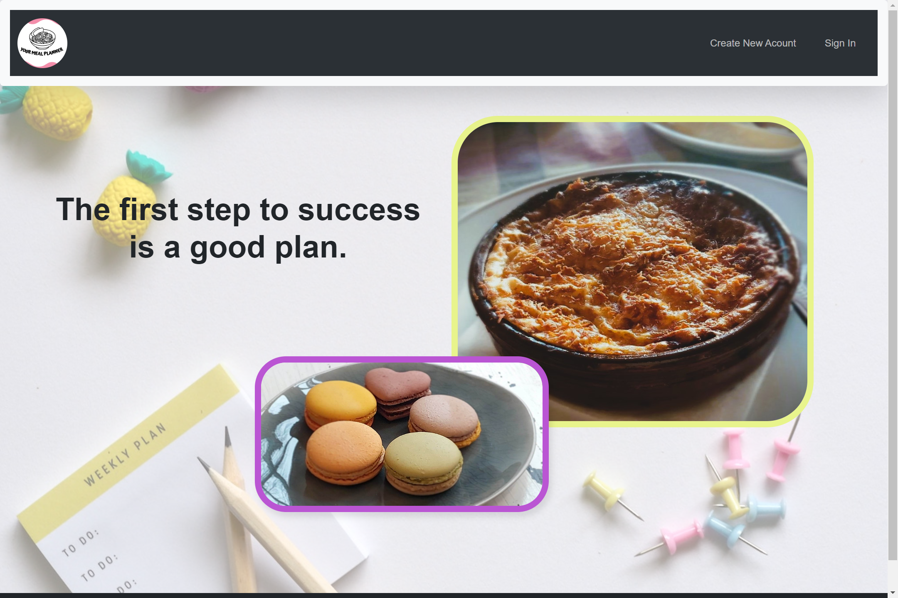
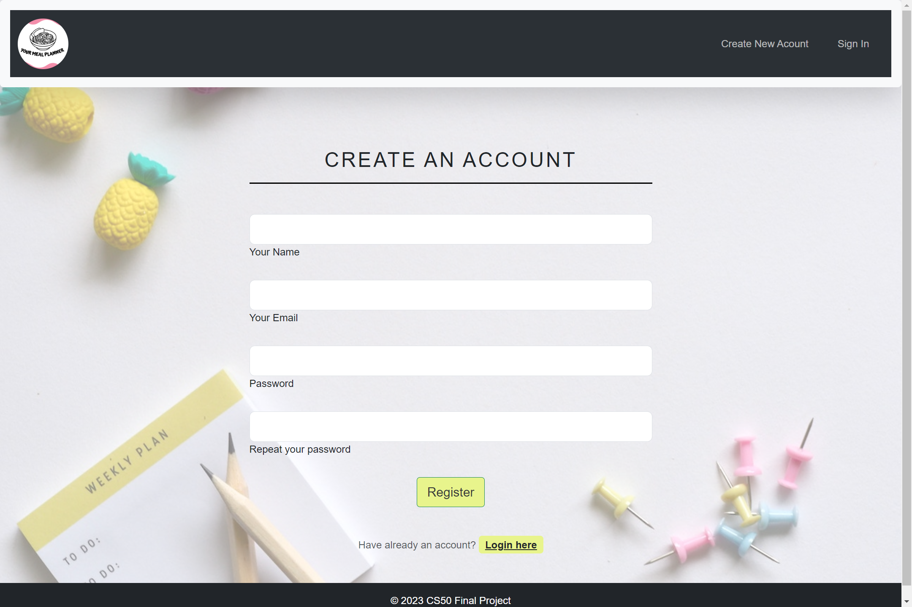
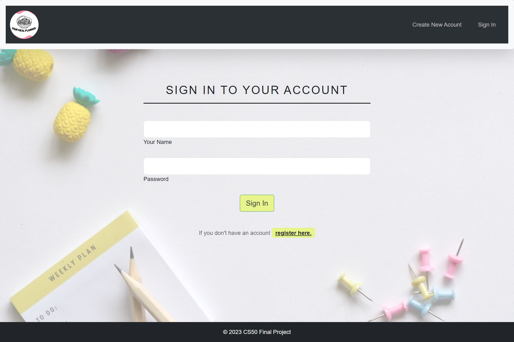
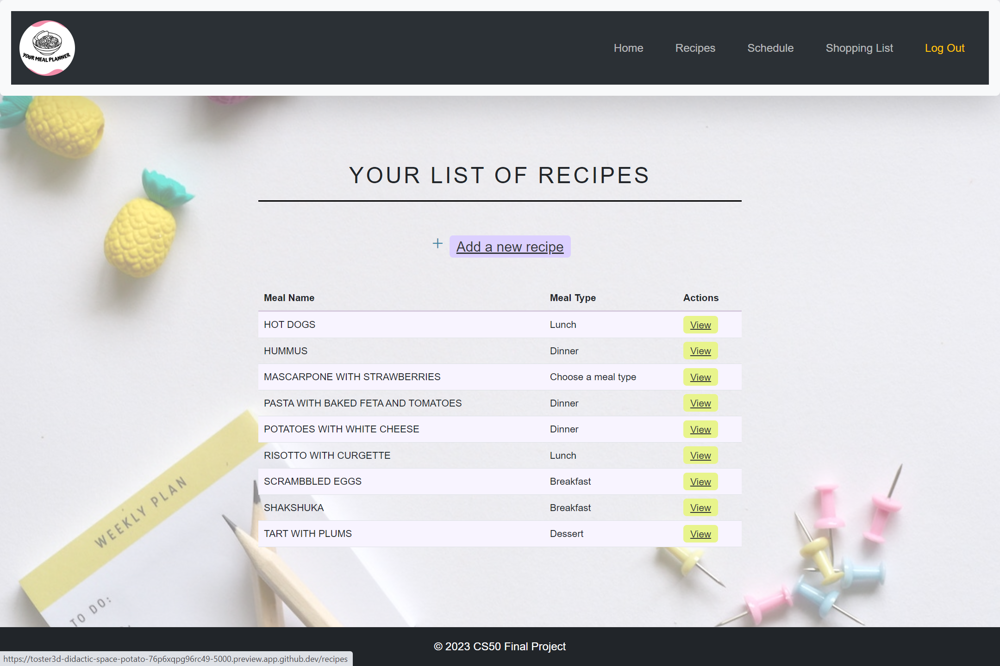
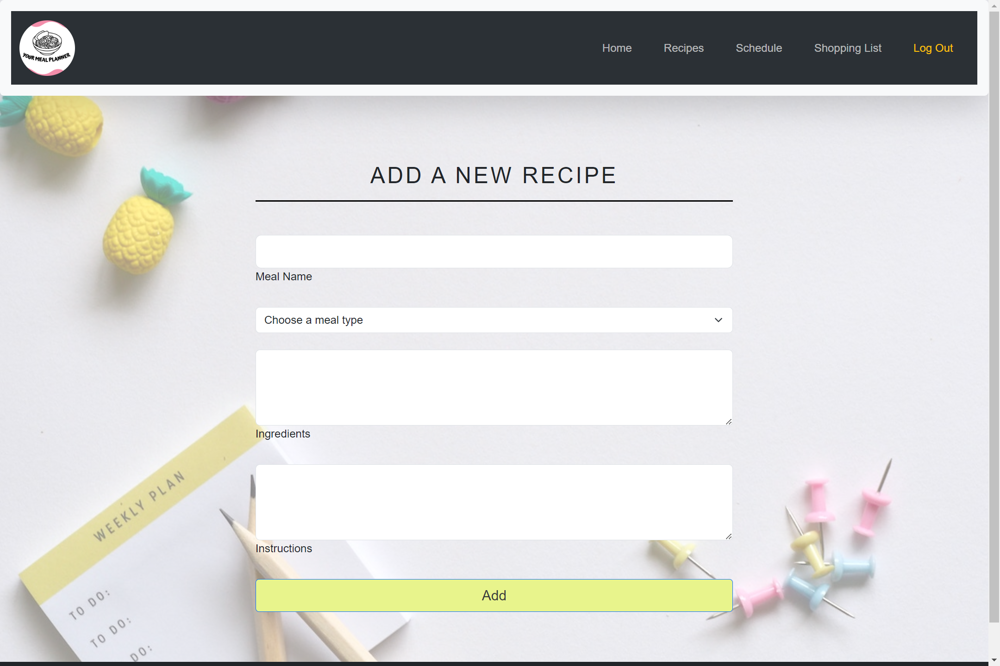
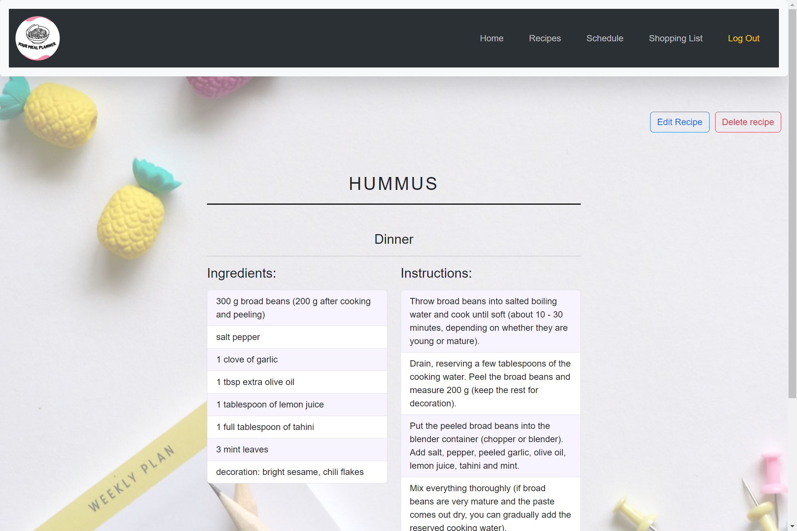
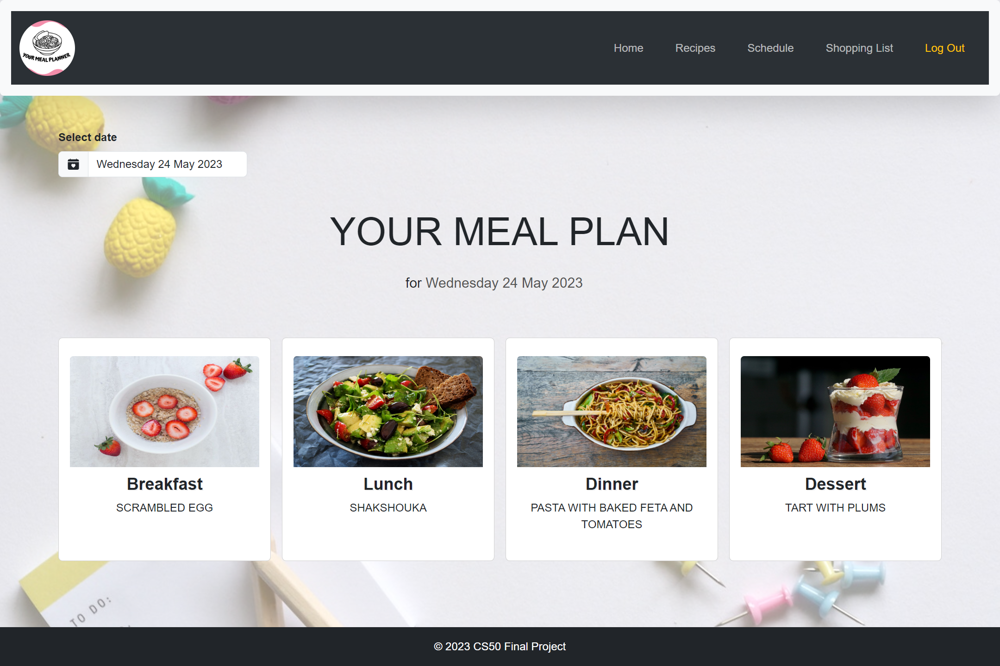
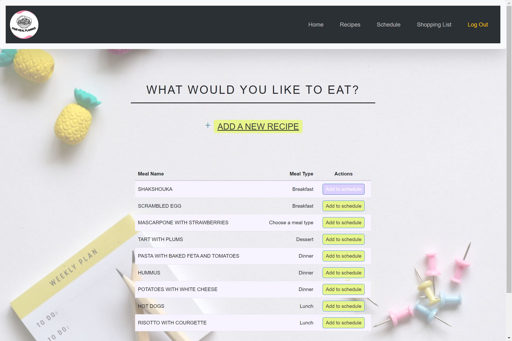
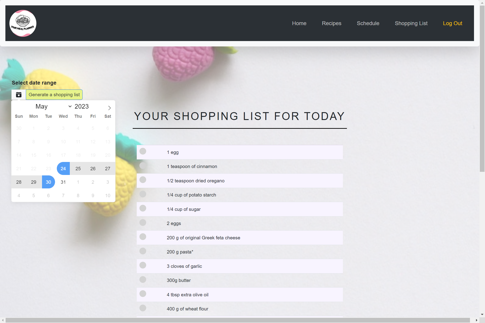
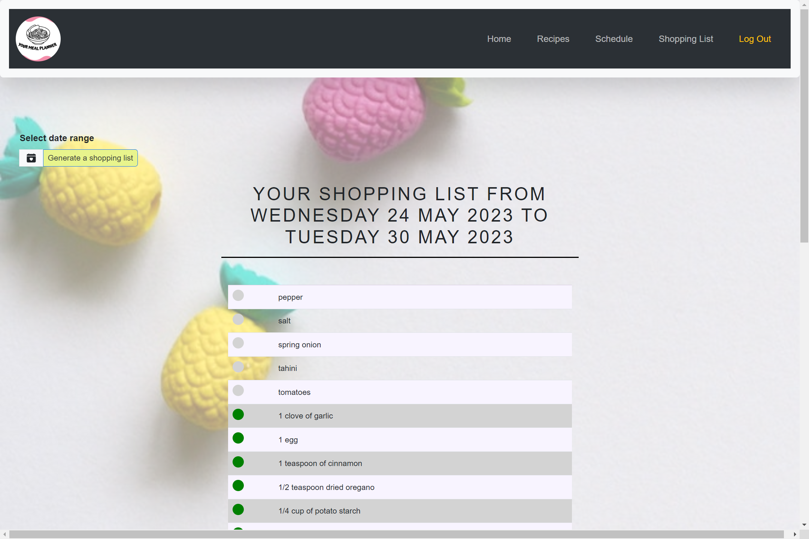

# YOUR MEAL PLANNER
#### Video Demo:  <https://youtu.be/-IESrT704lQ>

## Contents:
* [Description](#description)
* [Features](#features)
* [Technologies](#technologies)
* [Instructions](#instructions)
* [Author](#author)

## Description

A web application for meal planning, recipe management, and generating shopping lists. It allows users to organize their meals for several days in advance, view the history of meal plans, add their own recipes, and generate a shopping list based on the planned meals. This project was created for the CS50 course.

## Features
- Users can register and log in to the application.
- Users can browse, add, edit, and delete recipes.
- Users can plan meals for selected days and add recipes to each meal.
- The app generates a shopping list based on planned meals for the selected date range.
- User-friendly interface with easy navigation and intuitive forms.

## Technologies
- Python 3
- Flask (microframework)
- SQLite3 (database)
- JavaScript
- HTML5
- CSS3
- Jinja (templates)
- Bootstrap 5.3.0-alpha3 (front-end framework)

## Instructions

### Homepage

### Register
To create an account, click on the "Create New Account" link on the homepage and provide a username, password, and email address. After successful registration, you will be redirected to the login page. Please note that the password must meet the standard password requirements: between 8 and 20 characters and contain at least one number, one uppercase letter, one lowercase letter and one special character (!#?%$&). After successfully creating a new account, the data you provide will be stored in the database.

### Login
To login click on the "Sign In" link on the homepage and enter your username and password. If the credentials are valid, you will be logged in and redirected to the homepage. If you don't have an account yet, you can click on the link ("register here") at the bottom of the form, which will redirect you to the registration page.

### Manage Recipes

### Recipe List

After successfully logging into your account go to the "Recipes" section and add your own recipes. Here you can also see a list of your recipes sorted by name.

### Add Recipe

To add a new recipe, click on the "Add a new recipe" button above the recipe List. Fill in the required details, such as the meal name and meal type. You can also add ingredients and instructions wchich are not required, but may be useful to use all the functions of the application. Click the "Add" button to add the recipe to your collection. All recipes you add are stored in the database.

### View Recipe

To view a recipe, click the button next to the recipe you want to view on the recipes page. You will be redirected to a new tab where you can see the entire recipe including ingredients and instructions.

### Edit Recipe

To edit a recipe stay on the recipe display page and press the "Edit recipe" button in the upper right corner of the page. Update the desired fields and click the "Save Changes" button to save the changes to the databese.

### Delete Recipe

To delete a recipe, stay on the recipe display page and click the "Delete Recipe" button. Confirm the deletion, and the recipe will be removed from your collection.

## Schedule

Navigate to the "Schedule" section where you can freely arrange your meal plans for each day using the recipes you have saved. As soon as you enter the site, the meal plan for the current date is displayed, but you can change it by clicking on the calendar text box on the upper left corner of the page. After clicking, you can choose any date for which you want to arrange a meal plan, or look into the past to track the history of meals. By clicking on a specific meal (e.g. "breakfast") you are transferred to a list of recipes, from which you can choose one by clicking on the "Add to schedule" button. On this page, you can also add a new recipe to the list. After clicking the "Add to schedule" button, you are automatically redirected to the schedule page, where the selected recipe is displayed in the card (in this case "breakfast"). You can always change the selected recipe to another. All meal plans are stored in a separate database.

## Shopping List

Go to the "Shopping List" section and view the generated shopping list based on the planned meals. After opening the page, the shopping list for the current day is displayed, but you can change it and set the date range by clicking on the calendar icon in the upper left corner. Select your preferred date range and then the "Generate a shopping list" button to see the list of products needed to complete the recipes selected in the schedule. When you click on the circle next to the product, it will turn green and the product will be moved to the bottom of the list as purchased.

## Author
Jagoda Spychala

